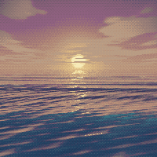

# Eric Jingryd

Software engineer in Gothenburg, Sweden. I build secure, well-tested software,
mostly in Rust, with TypeScript and Python where they fit the job better.
Looking for a software engineering role in Gothenburg, Stockholm, hybrid or
remote.

## Projects

| Project | What it is |
|---|---|
| [linux-hardener](https://github.com/tidynest/linux-hardener) | Scans and hardens Linux systems, maps findings to ten compliance frameworks and rolls changes back from Ed25519-signed checkpoints. 2,300+ tests, six distributions, on the [AUR](https://aur.archlinux.org/packages/linux-hardener). |
| [raven-nest-mcp](https://github.com/tidynest/raven-nest-mcp) | MCP server that gives AI assistants controlled access to 22 security tools behind six safety layers. Listed in the official MCP Registry. |
| [raven-nest-client](https://github.com/tidynest/raven-nest-client) | TypeScript and Bun client for it, with 112 tests. |
| [bitnet-toy](https://github.com/tidynest/bitnet-toy) | BitNet b1.58 written from scratch in Rust: autograd, a transformer and CUDA kernels, no ML libraries. |
| [hypr-keybind-manager](https://github.com/tidynest/hypr-keybind-manager) | GTK4 keybinding manager for Hyprland with conflict detection. On the [AUR](https://aur.archlinux.org/packages/hypr-keybind-manager). |
| [CommandVault](https://github.com/tidynest/CommandVault) | Desktop app for storing, searching and copying shell commands, built with iced. |
| [tv-tabla](https://github.com/tidynest/tv-tabla) | Desktop TV guide for Swedish television, built with Tauri and SolidJS. |

Closed source for now: Hamnkapten, a sauna booking system for the boatyard
where I work, built with axum, PostgreSQL, Leptos and Slint and covered by
1,100+ tests. And a constraint-satisfaction engine in Rust.

More on [ericjingryd.com](https://ericjingryd.com) and
[LinkedIn](https://www.linkedin.com/in/eric-jingryd/).

The sea is an animated PNG baked by [pixel-sea](https://github.com/tidynest/pixel-sea):
seven wave components, a 20-second seamless loop, no JavaScript.
